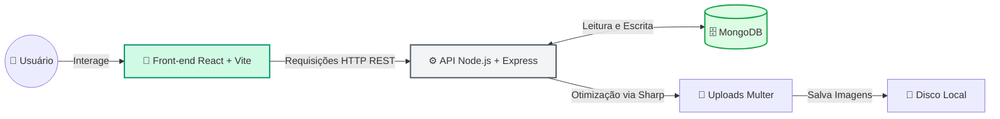

# 🌿 Green Urban

<p align="center">
  
  
  
  
  
</p>

> **Reconectando pessoas à natureza através da tecnologia, educação botânica e ação comunitária.**

---

## 📖 Sobre o Projeto

O **Green Urban** nasceu para resolver um problema moderno: a desconexão dos centros urbanos com o meio ambiente. Muitas pessoas desejam cultivar plantas em casa, mas desistem por falta de instrução prática. Ao mesmo tempo, iniciativas ecológicas locais sofrem com a baixa adesão da comunidade.

Nossa plataforma atua em duas frentes principais: **democratizar o cuidado botânico** e **transformar a ação ambiental em um jogo coletivo** através de um sistema de gamificação de eventos presenciais.

---

## ✨ Funcionalidades Principais

* 🌱 **Assistente Inteligente:** Catálogo interativo com filtros dinâmicos (Exposição ao Sol, Espaço, Frequência de Rega) que entrega recomendações personalizadas e dicas de cultivo.
* 🎮 **Gamificação de Eventos Ecológicos:** Plataforma de voluntariado onde organizadores criam ações de plantio e limpeza. O usuário faz o *check-in* no local validando um **PIN exclusivo** e enviando uma **foto-comprovante**, gerando pontos de experiência (XP).
* 📸 **Rede Social Verde:** Feed comunitário no formato carrossel, com suporte a upload múltiplo de imagens e redimensionamento automático otimizado no backend.
* 📚 **Dicionário de Plantas:** Interface fluida para consulta rápida de espécies.
* 🎨 **Design Moderno:** Interface responsiva construída com Tailwind CSS, adotando conceitos de *Glassmorphism* para uma navegação orgânica e limpa.

---

## 🛠️ Arquitetura do Sistema

O ecossistema foi construído sob uma arquitetura limpa, separando completamente as responsabilidades entre Front-end e Back-end.



### 📂 Estrutura de Pastas

```text
📦 Green-urban
 ┣ 📂 backend
 ┃ ┣ 📂 controllers   # Regras de negócio e processamento
 ┃ ┣ 📂 middlewares   # Configurações do Multer e Sharp
 ┃ ┣ 📂 models        # Schemas do MongoDB
 ┃ ┗ 📂 routes        # Endpoints da API REST
 ┗ 📂 frontend
   ┣ 📂 src
   ┃ ┣ 📂 assets      # Imagens e ícones estáticos
   ┃ ┣ 📂 components  # Componentes reutilizáveis (Cards, Navbar)
   ┃ ┗ 📂 pages       # Telas principais (Assistente, Rede Social, etc.)
```

---

## 🚀 Como Executar o Projeto Localmente

### Pré-requisitos
* [Node.js](https://nodejs.org/) (v18+)
* Instância local ou cluster do [MongoDB](https://www.mongodb.com/)

### 1. Clonar o repositório
```bash
git clone [https://github.com/JoaopedroHZN/Green-urban.git](https://github.com/JoaopedroHZN/Green-urban.git)
cd Green-urban
```

### 2. Configurando o Back-end
```bash
cd backend
npm install
```
Crie um arquivo `.env` na pasta `backend/` contendo suas variáveis de ambiente:
```env
PORT=4000
MONGODB_URI=mongodb://localhost:27017/green_urban
```
Inicie o servidor da API:
```bash
npm run dev
```

### 3. Configurando o Front-end
Abra um novo terminal na raiz do projeto e acesse o cliente:
```bash
cd frontend
npm install
npm run dev
```
Acesse a aplicação no navegador através de `http://localhost:5173`.

---

## 🎓 Contexto Acadêmico

Projeto desenvolvido como requisito de avaliação para a disciplina de **Desenvolvimento de Software para Web**, do curso de **Engenharia de Software** da **Universidade Luterana do Brasil (ULBRA) - Campus Palmas/TO**.

---

## 👨‍💻 Desenvolvedores

| [<br><sub>João Pedro</sub>](https://github.com/JoaopedroHZN) | [<br><sub>Carlos Eduardo</sub>](#) |
| :---: | :---: |
| Engenharia de Software | Engenharia de Software |

<p align="center">
  Feito com 💚 e muito código no Tocantins.
</p>
